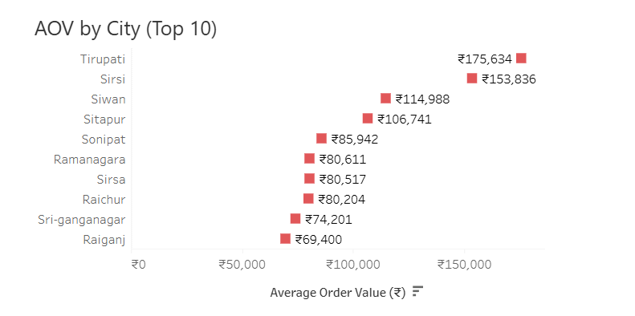
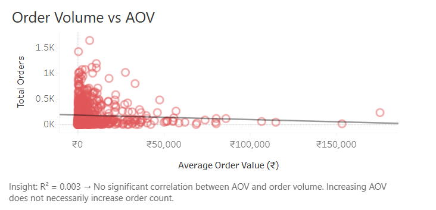
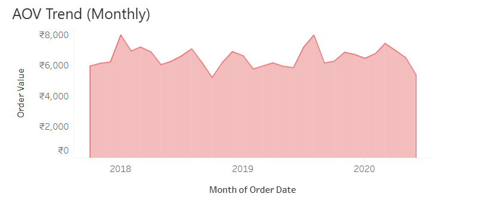

# Zomato AOV Performance Analysis

## Project Overview
This project analyzes Zomato order data to evaluate Average Order Value (AOV), customer behaviour, revenue concentration, and monetization efficiency using Excel and Tableau.

The objective was to identify structural inefficiencies affecting revenue quality despite strong transaction volume.

## Business Problem
Despite high order volume, revenue quality remained inconsistent across customer segments and cities.

This analysis investigates:
- Revenue concentration patterns
- Customer retention depth
- Income vs spending behaviour
- City-level AOV variation
- Order volume vs revenue quality

## Tools Used
- Excel
- Power Query
- Pivot Tables
- Tableau

## Dataset Scope
- 147,061 Orders
- 77,584 Customers
- Revenue: ₹96.4 Cr
- Time Period: May 2018 – May 2020

## Data Cleaning & Validation
- Removed negative-value transactions
- Excluded unsupported currency transactions
- Validated one-to-many relationships
- Checked foreign key integrity
- Filtered invalid AOV rows

## Key Insights
- 76% of customers placed only 1–2 orders
- Top 10% of transactions contributed 78.7% of total revenue
- No meaningful correlation between AOV and order volume (R² = 0.003)
- Student segment generated highest order volume
- Revenue heavily concentrated in high-value transactions

## Business Recommendations
- Improve repeat customer retention
- Reduce dependency on student segment
- Increase mid-tier monetization
- Optimize city-level pricing strategies

## Final Conclusion
The analysis revealed that strong order volume does not necessarily translate into high-quality revenue generation. Customer retention depth, revenue concentration, and dependence on specific customer segments were identified as major business concerns.

This project combined Excel-based data validation and Tableau visualization techniques to evaluate monetization efficiency and customer behaviour patterns.

## Dashboard Visuals

### AOV by City

### Order Volume vs AOV

### Monthly AOV Trend

## Interactive Tableau Dashboard
[View Full Interactive Dashboard on Tableau Public](https://public.tableau.com/app/profile/praneetha.d3255/viz/Zomato_Revenue_Analysis/AOVPerformanceDashboard)
